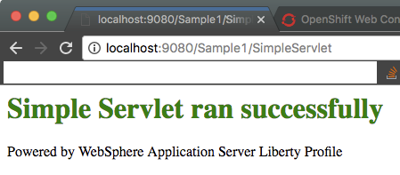

# Openshift s2i-websphere-liberty

This image tries to compile everything you'd need to build a webspher liberty image into one build process for openshift.

It generalizes the build process, so that you can use one builder image for all applications, without having to create multiple Dockerfiles and file repositories. Also, some openshift tags are added and tweaks are made, so that the image can run as a non-root user. Eventually I'll add this as a template for an instant-app.

During the build process shared libraries, EAR/WAR files, and the `server.xml` file are added to your liberty container.

## Overview

Your repository should take this structure
  ```
  example
  ├── dropins
  │   └── Sample1.war
  ├── jvm.options
  └── server.xml
  ```

1. Features are parsed from `server.xml` and installed at build time.
  * This is nice because you can just modify `server.xml`, add featuresets, and the container is rebuilt automagically.
2. JVM options can be added with a `jvm.options` file, which is copied to `/config/jvm/options`
2. Dropins are copied from `dropins` to `config/dropins`
3. Libs will be copied from `lib/` to `/config/lib`
  * You can source these shared libraries in your `server.xml` using a `<library>` block as shown below.
  ```xml
    <library id="MSJDBCLib">
        <fileset dir="${server.config.dir}/lib">
    </library>
    ```

## Usage
In this example, we're going to use the example directory from my git repo. If you've created your own app using the above file structure, remove the `--context-dir` parameter and substitute youre repo URL.

  ```shell
  s2i build https://github.com/stobias123/s2i-websphere-liberty.git --context-dir=example websphere-liberty-openshift sample-app
  ```

Now navigate to http://localhost:9080/Sample1/SimpleServlet
you'll see the below.

